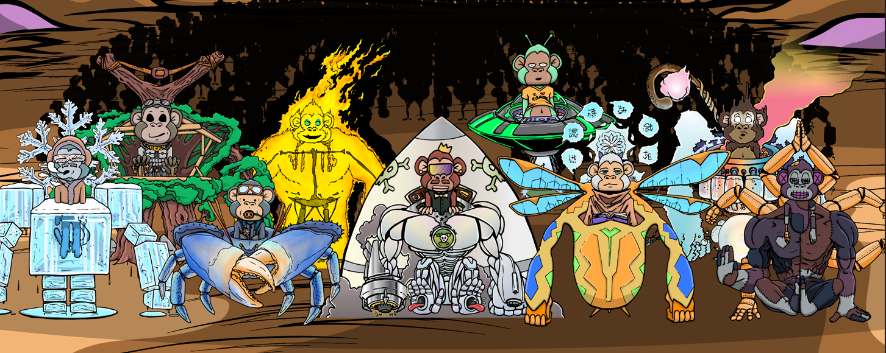

Visit the [Live Website](https://MechaMonkeys.io/)!
Visit our [OpenSea Listing](https://opensea.io/collection/mecha-monkeys)!
See the contract [live on the blockchain](https://etherscan.io/address/0x1894852504288219fa835af44528571d543958a1#code)!

# About
A custom ERC721 contract for Ethereum that is a "free-mint" of an NFT collection with 10k tokens pointing to 10k immutable IPFS hashes.

Although the images and metadata are immutable, the release still included multiple stages. This was accomplished by pre-defining the IPFS hashes for each release, but not host the files of later stages until it was time for the contract to progress to that stage. This is similar to publicly displaying Torrent hashes without seeding any of the data until intended to.

- `Solidity` for the Ethereum contract
- `npm` for packaging and testing
- `truffle` for testing and flattening for deployments

# Credits
- Designer and author
  - Blake Scherschel
    - github.com/bscher
    - twitter.com/dev_mecha

- Graphics and animations
  - twitter.com/metta_monkey

# Proof of ownership
## Message

```
"Mecha Monkeys" is an ERC721 collection of 10k unique NFTs. Created by github.com/bscher along with artist twitter.com/metta_monkey
This message is signed by the address that owns the "Mecha Monkeys" ERC721 contract, deployed as: 0x1894852504288219fa835af44528571d543958a1

[Contract]: https://etherscan.io/token/0x1894852504288219fa835af44528571d543958a1#code
[OpenSea listing]: https://opensea.io/collection/mecha-monkeys
[License]: https://github.com/bscher/solidity-MechaMonkeys/blob/main/LICENSE (All rights reserved.)
[NFT image license]: "No License"; No warranty or liability is expected.

Interested in speaking with the creator of the Ethereum contract and website? Contact twitter.com/dev_mecha
Interested in speaking with the artist who created the NFT and website art? Contact twitter.com/metta_monkey
```

## Signature

```
{
  "address": "0xd56fb3b1ec90a7af529e31d0c3d8e1b2ecf6790f",
  "msg": "0x224d65636861204d6f6e6b6579732220697320616e2045524337323120636f6c6c656374696f6e206f662031306b20756e69717565204e4654732e2043726561746564206279206769746875622e636f6d2f62736368657220616c6f6e6720776974682061727469737420747769747465722e636f6d2f6d657474615f6d6f6e6b65790a54686973206d657373616765206973207369676e65642062792074686520616464726573732074686174206f776e732074686520224d65636861204d6f6e6b657973222045524337323120636f6e74726163742c206465706c6f7965642061733a203078313839343835323530343238383231396661383335616634343532383537316435343339353861310a0a5b436f6e74726163745d3a2068747470733a2f2f65746865727363616e2e696f2f746f6b656e2f30783138393438353235303432383832313966613833356166343435323835373164353433393538613123636f64650a5b4f70656e536561206c697374696e675d3a2068747470733a2f2f6f70656e7365612e696f2f636f6c6c656374696f6e2f6d656368612d6d6f6e6b6579730a5b4c6963656e73655d3a2068747470733a2f2f6769746875622e636f6d2f6273636865722f736f6c69646974792d4d656368614d6f6e6b6579732f626c6f622f6d61696e2f4c4943454e53452028416c6c207269676874732072657365727665642e290a5b4e465420696d616765206c6963656e73655d3a20224e6f204c6963656e7365223b204e6f2077617272616e7479206f72206c696162696c6974792069732065787065637465642e0a0a496e746572657374656420696e20737065616b696e672077697468207468652063726561746f72206f662074686520457468657265756d20636f6e747261637420616e6420776562736974653f20436f6e7461637420747769747465722e636f6d2f6465765f6d656368610a496e746572657374656420696e20737065616b696e67207769746820746865206172746973742077686f206372656174656420746865204e465420616e642077656273697465206172743f20436f6e7461637420747769747465722e636f6d2f6d657474615f6d6f6e6b6579",
  "sig": "5968ab3790485ee593a3bac7b66f7a92db8213ba358b43872bae113ae82f424012ffc8aaa3b87bd2df3604bb9b1f7342d68e076b85fa7a4499841089b4ce45661c",
  "version": "3",
  "signer": "MEW"
}
```